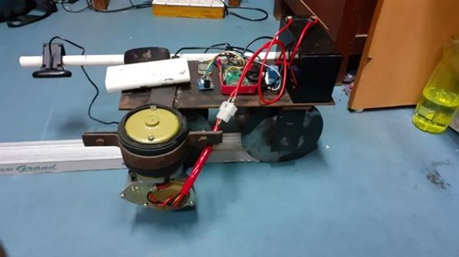
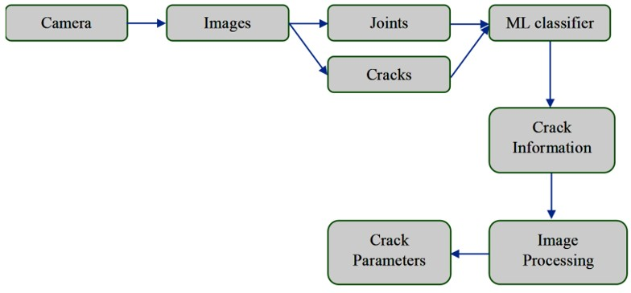

# Railway-Track-Inspection-Robot

This repository contains the code for a robotic system that was developed as part of a team project during my Bachelor's degree. My main contribution focused on the **Machine Learning-based Computer Vision** approach for **crack detection on railway tracks**, including code for **feature extraction**, and **training classification models**.

The project was a collaborative effort with a total of six contributors and was awarded a **patent** under the title "A ROBOTIC SYSTEM FOR INSPECTION OF RAILWAY TRACKS" (Patent granted December 2024 by The Patent Office, Government of India). You can find the patent certificate in the `docs/` folder.

## Assembled Hardware

<p align="center">
  
</p>

## Overview
The work involved the design and development of railway track-inspection robotic system. The following hardware and software were used:

A. Hardware:

  i. For Inspection: A Raspberry pi (RPi) as controller, a Relay as motor driver and a 12V DC motor were used. A specially fabricated chassis made of steel was used as the inspecting vehicle with the above said components installed in it.
  
  ii. For Imaging system: Raspberry Pi (same module) as processor, a 5 MP webcam interfaced via USB port of RPi and a GPS module for geotagging and timestamping.
  
B. Software: 

Python and OpenCV were used for the ML and IP codes, respectively.

## Computer Vision Approach for Feature Extraction

The dataset consisted of 240 images of joints and cracks. To build the feature vector combination of both global and local descriptors were utilized. The descriptors: Color histogram – quantifying the color, Hu Moments
– quantifying the shape, Haralick Texture – quantifying the texture, were selected because a crack can be better described by the difference in color distribution, shape discontinuities and texture generalization. The extracted features were concatenated into a single feature descriptor. The corresponding labels were set: 0 for joints and 1 for cracks.

## Machine Learning Approach for Classification

The following ML models were tested to solve the problem of classification: Logistic Regression (LR), Linear Discriminant Analysis (LDA), K-Nearest Neighbors (KNN), Decision Trees (DT), Random Forests (RF), Gaussian Naïve Bayes (GNB), Support Vector Machine (SVM). To predict ML Model’s accuracy, K-fold cross validation technique was used. In this, we chose K=5, the entire data was split into 4 training parts and 1 testing part, uniquely for each round up to 5 times. Based on this, the model accuracy for all ML models were generated and based on the comparison plot Logistic Regression was finalized.

## Edge Inferencing

Image capturing was done using a moving vehicle, that was controlled by an on-board computer. The camera interfaced to the computer was enabled at regular intervals and the images are recorded accordingly. The features were extracted from the images and the classification was carried out in real-time. The process flowchart is as follows:

<p align="center">
  
</p>

## Project Structure

- `docs/`: Contains the patent certificate.
- `images/`
- `src/`: Contains the source code files.
  - `feature-extractor.py`: Code for loading images of joints and cracks, extracting the features and building the dataset with target labels.
  - `classification_models.py`: Code for testing different ML classification models (e.g., Logistic Regression, SVM).
  - `final_model.py`: Code for training the final model using **Logistic Regression** and saving it.
- `requirements.txt`: Lists all necessary Python libraries for the project.

## Installation

1. Clone this repository:
    ```bash
    git clone https://github.com/Swapnajoy/Railway-Track-Inspection-Robot.git
    ```
2. Install dependencies:
    ```bash
    pip install -r requirements.txt
    ```
## Dependencies

- `scikit-image`
- `scikit-learn`
- `opencv-python`
- `numpy`
- `seaborn`
- Other necessary libraries listed in `requirements.txt`.
